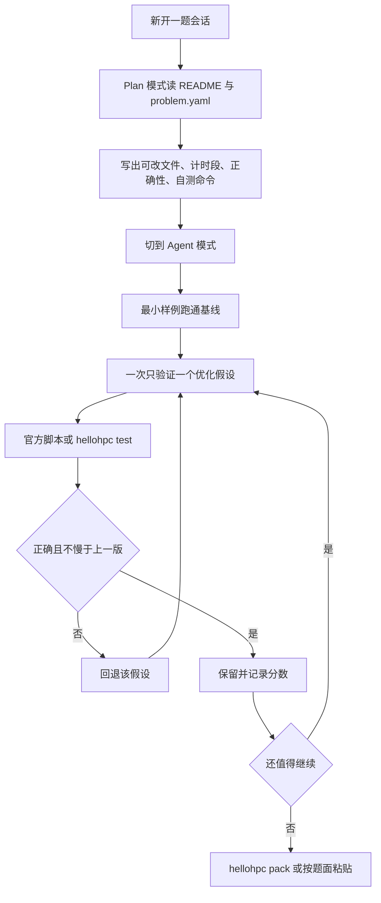

# Cursor Agent 开发 HelloHPC 工作流 SOP

比赛窗口到 **2026-09-28 12:00**。本仓库是第二届上海交通大学高性能计算综合能力竞赛（HelloHPC）的个人赛源码。官方允许使用 Agent 辅助答题，但提交者对结果负责，包括违规提交。

本 SOP 约束 Cursor Agent 如何在可改边界内迭代优化，并用官方自测口径验收。目标是改对计算本身，而不是改评测器或搬移计时。

规则与本文都放在题目目录之外，避免被 `hellohpc pack` 打进提交包。实验笔记写到 `docs/notes/<题号>.md`，同样不要放进可提交目录。

## 0. 硬约束（每条会话开头复述）

- 个人赛。不引入他人代码、不打表、不针对样例或种子特判、不把计时段内的计算挪到计时外、不伪造计时或协议输出。
- 只改该题 `problem.yaml` 的 `workspace.editable`。`readonly`、checker、interactor、baseline、评分脚本一律只读。
- 提交源码。不提交编译产物、混淆代码、预编译内核、预计算答案。
- 登录节点禁止编译、并行计算，以及会拉高负载的语言服务。开发走 `kp_interact`（最多 8 核，最长 8h）；超过 8 核的正式自测用 `sbatch` 提交 `kp_run`（最多 128 核、1 个节点、最长 2h）。
- NPU：`contest-slice` 必须申请 12 核 CPU + 1 卡，每 4h 最多用 3h；`contest-full` 必须申请 192 核 + 8 卡，仅 LLM Stage1 满分后解锁，每 3h 最多用 2h。
- 评测在容器内，GCC、CMake、Python 与集群默认版本不一致。优化不得依赖登录节点上的特定库版本。允许 `module load` 的题目，要把加载写进该题的 `env.sh` 或 `run.sh`。
- 本地分只说明公开算例合法。打榜题（Mahjx、Ragged Softmax Moments）本地非 0 分不等于 OJ 分。
- 赛后 48 小时提交整体 writeup，覆盖所有得分不为 0 的题目。每个有效实验在题外笔记里记录：假设、改动、公开分数、失败原因。

集群上的 HelloHPC CLI：

- CPU 集群：`/vault/public/xflops/bin/hellohpc`
- NPU 集群：`/nfs/bin/hellohpc`

在含 `problem.yaml` 的题目目录执行 `hellohpc test` 与 `hellohpc pack`。

## 1. 会话怎么开

一题一个 Agent 聊天。不要在同一会话里跨题改文件。

开工提示词固定四段，贴进该题会话的第一条消息：

1. 题目目录与必读：该题 `README.md`、`problem.yaml`。
2. 任务：先复述可改文件、计时区间、容差和自测命令，再做优化。未复述前不要改代码。
3. 验收：给出命令、耗时、正确性结论。失败则回退，不要在错误版本上叠加补丁。
4. 禁止：列出该题 README 里的作弊条款（打表、降精度、挪计时、改 checker）。

Cursor 用法：

- 不熟悉的题先用 Plan 模式，确认瓶颈和改动范围后再改代码。
- 只把该题 README、`problem.yaml` 和即将修改的文件加入上下文。不要把整个仓库或评测器源码塞进上下文。
- 探索框架代码用只读搜索。子代理只负责读代码和定位热点，不改 `readonly` 路径。
- 一次对话只推进一个假设。并行实验用 git 分支或单独工作区，避免两个 Agent 写同一文件。
- 重负载命令由人在计算节点执行。Agent 在登录节点上只改源码、读日志，不启动 `make -j`、MPI 或 NPU 测试。

## 2. 单题迭代循环

每轮只做下面六步：

1. **冻结接口。** 函数名、参数、协议输出、进度标记、`BLACKHOLE_TIME` 行、OpenAI 兼容接口保持不变。
2. **基线。** 用该题最小公开样例确认能编过、能对上。大样例基线可能远超零分线，不要一上来跑 `huge` 或全量 Stage2。
3. **定位。** 先看算法复杂度和访存，再谈编译旗标。记录热点函数和数据规模（Q/C/D、ranks、S/N/D、并发与上下文长度）。
4. **一刀。** 只改一类事情：并行、SIMD、访存、算法，或编译参数。改完立刻用同一小样例对正确性。
5. **计分口径自测。** 使用题目自带脚本或 `hellohpc test`。性能分看题面规定的统计量：最大值、平均值或 `ELAPSED_SECONDS`。不要用选手自己插的计时当作分数。
6. **留痕。** 更好则保留；变慢、变错、超时则回退。笔记写到 `docs/notes/<题号>.md`，不放进可提交目录。

提交前检查：

- `git diff` 只出现该题 editable 路径。
- 没有 `.o`、可执行文件、`build/`、缓存答案。
- `env.sh`、`run.sh`、`build.sh` 在干净 shell 里可重复。
- 按题面 `hellohpc pack`，或把题面指定的文件粘贴到网站。OJ 以正式评测为准。

## 3. 分题操作卡

- **核场响应** [`03-accelerate`](../03-accelerate)：32 核，`kp_run`。只改 [`src/solver.py`](../03-accelerate/src/solver.py)、[`env.sh`](../03-accelerate/env.sh)。计时只包正式 `compute_field`，性能分取 3 次 wall time 的最大值。容差 `rtol=1e-4`、`atol=1e-5`。先 `python3 benchmark.py sample`，再 `public-large-b`。网站粘贴这两个文件。不要用 GPU，不要让外部库代做距离、点积和归约。正确性 20 分过不了就没有性能分。仓库原版 Python 会在正式正确性用例超时。
- **Cheatsheet** [`04-cheatsheet`](../04-cheatsheet)：2 核，`kp_interact`。提交 [`submission.yaml`](../04-cheatsheet/submission.yaml)、[`SKILL.md`](../04-cheatsheet/SKILL.md) 和可选 `references/**/*.md`，合计不超过 1200 tokens。这是给考场 Agent 的操作指南，不能写入完整算子源码，也不能用压缩、编码或混淆规避。先选算子 `bitmatrix` 或 `fft`，以及模型 `qwen3.8-27b` 或 `deepseek-reasoner`。本地需要 `.env`，该文件不进提交包。先 `hellohpc validate`，再 `hellohpc test --output result.json --keep-workspace`。考场 Agent 只能改 `kernel.cpp` 与 `compile_options.txt`，单核。默认编译参数为 `g++ -O3 -march=native -fopenmp -std=c++17 -funroll-loops`。
- **Miniclash** [`05-miniclash`](../05-miniclash)：32 核，`kp_run`。改 `source_code/**` 与 `Makefile`。`make all` 必须产出可执行的 `run`。`./run tasks.txt` 为每行前缀生成两个内容不同、MD5 相同、且都以前缀开头的文件。只计时一次，没有 warmup，要同时控制最坏情况。不要改 `utils/verify.py`、`utils/gencase.py`、`utils/score_curve.py`。
- **Rune** [`06-rune`](../06-rune)：32 核，`kp_run`。只改 [`policy.py`](../06-rune/policy.py)。这是在线确定性调度，违反内存或能力约束则该场景 0 分。先 `cp bin/rune-cluster-aarch64 bin/rune-cluster`，用 `hellohpc test --set seed_count=1` 快速验证，确认策略稳定后再把 `seed_count` 提到 64。不要改 `rune_scheduler/` 和 `profiles/`。
- **MaiMoe** [`07-maimoe`](../07-maimoe)：8 核，可在 `kp_interact` 开发。只改 [`solution/Kernel.cpp`](../07-maimoe/solution/Kernel.cpp) 和 [`solution/KstroParam.toml`](../07-maimoe/solution/KstroParam.toml)。`bash tools/build.sh` 后 `bash tools/test.sh --sample 1`，再逐步加样例。评分用 3 次正式测量的平均 wall time。数据在 `/vault/public/xflops/maimoe_data`。
- **Blackhole** [`08-blackhole`](../08-blackhole)：32 或 128 个 MPI rank，大样例走 `kp_run`。可改 `src/**` 与 [`env.sh`](../08-blackhole/env.sh)。构建命令是 `source ./env.sh && make -C src -j blackhole`，产物必须是 `src/blackhole`。开发初期只跑 `small`。计时取 `BLACKHOLE_TIME` 的 `max`。每个 iteration 内的通信和积分都算进时间。禁止跨 iteration 复用场或结果，禁止按样例名或特定数字特判。
- **Mahjx** [`09-mahjx`](../09-mahjx)：128 核打榜题，`kp_run`。可改 `build.sh`、`run.sh`、`src/**`。`bash build.sh && bash judger/provision.sh`，再用 interactor 与 checker 跑 `sample/`。程序必须逐事件读标准输入，并立刻写出 `FULL_ANALYZE_STEP`。分数用四个输入最后一条 `ELAPSED_SECONDS` 之和。`hellohpc pack` 只应包含 `build.sh`、`run.sh` 和 `src/` 里的源文件。浮点不低于 32 位，误差不超过 `1e-4`。game3 与 game4 隐藏，禁止对公开牌谱打表。
- **Ragged Softmax Moments** [`10-kernel`](../10-kernel)：NPU，队列 `contest-slice`。只改 `problem.yaml` 列出的 `solution/` 下 7 个文件，不能新增源文件。先 `source /nfs/scripts/kernel-dev.sh`，再 `hellohpc test --stream-output --artifacts-dir artifacts/runs`。只用 Ascend C 基础构件。设备全局临时内存最多 4 MiB。Host 不能靠完整形状组合、用例 ID 或种子识别用例。通过后执行 `hellohpc pack --output artifacts/rsm_submission.zip`。这是打榜题，公开加速比只作参考。
- **LLM Serving** [`11-llm`](../11-llm)：只改 [`submission/build.def`](../11-llm/submission/build.def) 和 [`submission/start.sh`](../11-llm/submission/start.sh)。顺序固定：`hellohpc test --case stage0` 构建不超过 20G 的 SIF，再测 stage1（1 卡 Qwen，30 分）。Stage1 满分后才申请 `contest-full` 做 stage2（8 卡，70 分，80 分钟，阶段内不能重启服务或更换参数）。Stage1 与 Stage2 运行时断网，依赖必须在 stage0 装进镜像。先做 smoke test，再跑全量。GSM8K 至少答对 1212/1319，否则 Stage2 整段为 0 分。

签到题 HelloHPC 与「小交问答」不在本仓库的优化循环里。

## 4. 每天收工

- 每题留下当前最好源码，以及一条分数记录：命令、样例、耗时、是否正确。
- `git status` 确认没有把构建产物和 `.env` 放进暂存区。
- 需要提交到 OJ 时由人执行 pack 或粘贴。Agent 不代发到评测网站。
- 赛题公告会更新。`git pull` 前先提交或另行保存本地修改，避免覆盖 `policy.py`、`solver.py` 等已经改过的文件。

## 5. Agent 不得做的事

- 修改 checker、interactor、`judge/`、`baseline/`、评分脚本，或在计时协议上做文章。
- 在登录节点跑并行编译或大样例。
- 为通过样例硬编码输入规模、文件名、种子或参考输出。
- 把完整算子实现写进 Cheatsheet 的 `SKILL.md`，包括压缩、编码、混淆等形式。
- 在可提交目录里新增评测器未列出的源文件。Ragged Softmax 题明确禁止新增源文件。
- 主动 `git commit` 或推远程，除非人明确要求。
